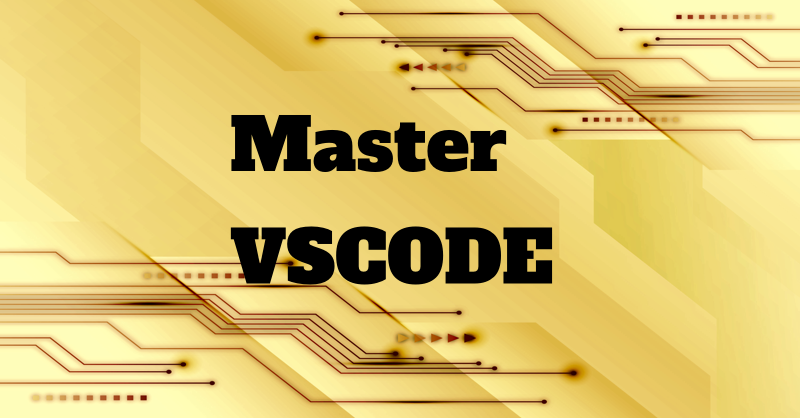

# Master VSCode

While I work on writing books you can check out my vscode setups of:

- Dart And Flutter
- Zettel Katsen via FOAM 
- ASCIIDoctor publishing (to avoid forcing people to learn latex to publish a book, instead you just have to know ascii form of markdown)

As things progress I will fill this out with guides, etc.

## Substack Newsletter

I publish a substack newsletter on dart and flutter at:

[Fred Grott's Substack](https://fredgrott.substack.com)